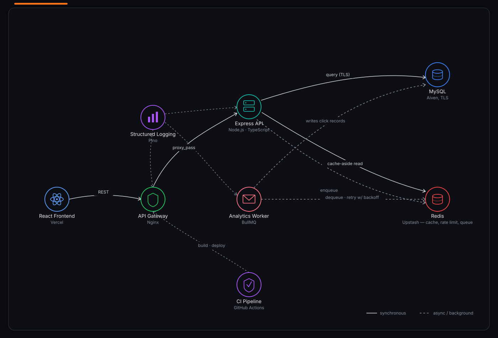
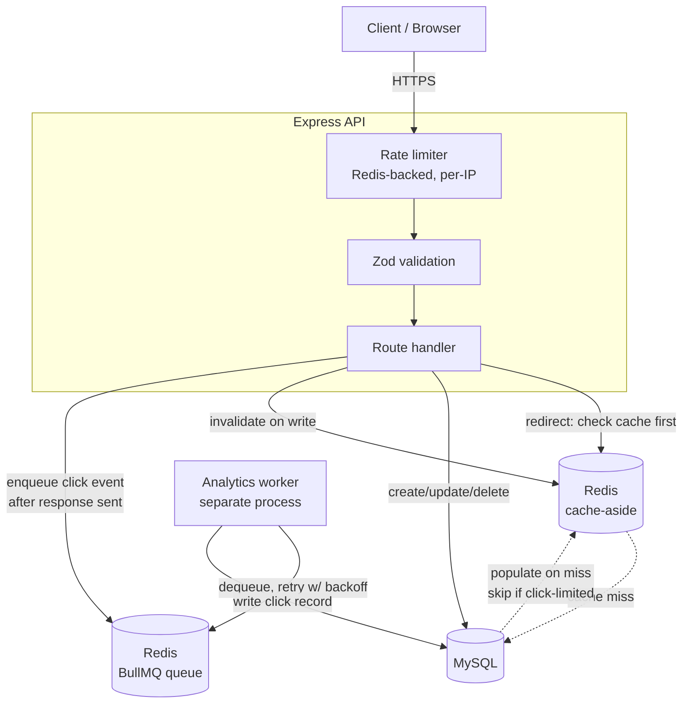
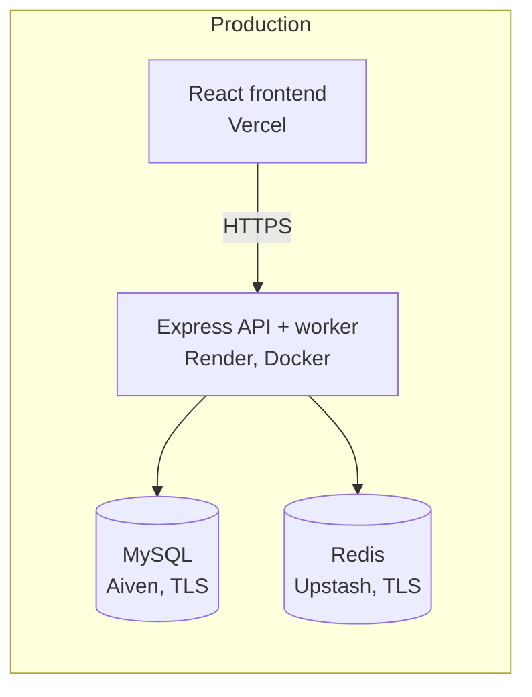
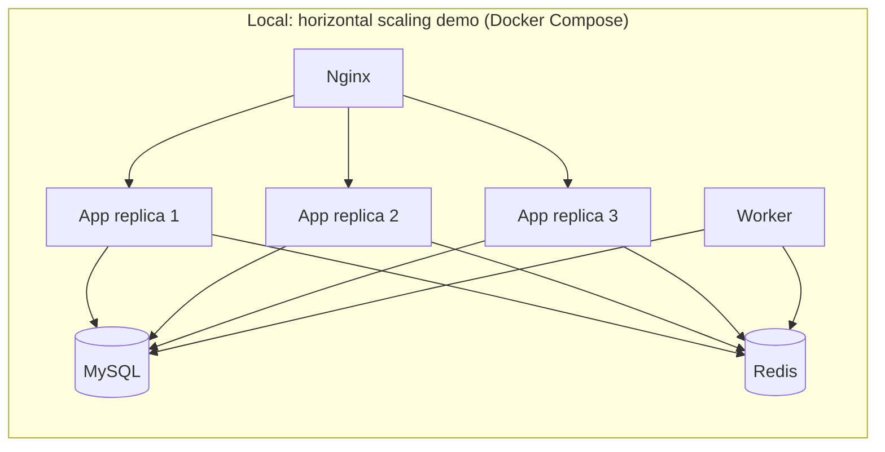

# URL Shortener

A production-grade URL shortening service — Express/TypeScript API, React dashboard, Redis caching, BullMQ-backed async analytics, and a fully containerized deployment path.

**[Live demo](https://url-short-l63y.onrender.com)** · **[Frontend repo](#)** *(update if hosted separately)*


> Render's free tier spins down after inactivity — the first request after idle time will be slow (cold start), not broken.

---

## Overview

This started as a learning project to work through the system-design patterns behind services like Bitly — short code generation, redirect caching, rate limiting, and async analytics — and grew into a full-stack app with real infrastructure: Docker Compose orchestration, horizontal scaling verified behind Nginx, load-tested performance numbers, and a live deployment on managed cloud services.

Beyond basic shortening, it supports custom aliases, link expiry, per-link click limits, and bcrypt-hashed password protection, all gated behind JWT-authenticated ownership so users can only manage their own links.

---

## Architecture



<details>
<summary>Text-based versions (Mermaid, renders on GitHub)</summary>

### Request flow



**Key design decisions, and why:**

- **Cache-aside, not write-through, for redirects.** Links are cached on first read (`GET`), not on creation — most links are read far more often than written, so caching on write would waste memory on links nobody clicks.
- **Click-limited links are never cached.** A cached click count would let traffic blow past `clickLimit` before the cache TTL expires and the real count is re-checked. Links without a limit cache normally; limited links always hit MySQL directly, trading a little latency for correctness.
- **Analytics are decoupled via a queue, not written inline.** The redirect response is sent *before* the analytics event is enqueued — a slow or failing analytics write can never delay or break a user's redirect. If the worker process goes down, events queue in Redis and drain automatically once it's back, with exponential-backoff retries on failure.
- **Rate limiting is Redis-backed, not in-memory.** An in-memory counter is per-process — under multiple app instances (see below), each instance would enforce its own separate limit, silently multiplying the real cap. A shared Redis store keeps the limit correct regardless of how many instances are running.

### Deployment topology





</details>

The app is stateless by design — no request depends on data held in one instance's memory, since rate limits, cache, and queued jobs all live in shared Redis/MySQL. This was verified directly, not just assumed: running 3 containerized app instances behind Nginx locally, a link created via one instance was immediately redirectable through another, and the rate limiter's 30-request cap held as a *global* limit across all 3 instances rather than 30-per-instance. Production currently runs a single Render instance; the architecture supports scaling to more without code changes.

---

## Features

- Short link creation with cryptographically secure random codes (not sequential/enumerable) or custom aliases
- Link expiry, per-link click limits, bcrypt-hashed password protection
- JWT authentication with per-user link ownership — update/delete restricted to the link's owner
- Redis cache-aside layer on the redirect path with TTL expiry and write-through invalidation on update/delete
- Redis-backed distributed rate limiting (separate limits for link creation, redirects, and auth endpoints)
- Async click analytics via a BullMQ worker queue — IP, country (GeoIP), browser, device, referrer — with retries and no impact on redirect latency
- Centralized error handling (`AppError` + Express error middleware) and structured JSON logging (Pino)
- Liveness/readiness health checks that verify real MySQL/Redis connectivity, not just process uptime
- Input validation via Zod schemas
- React dashboard: register/login, create links, view stats, copy/delete

---

## Tech stack

| Layer | Tech |
|---|---|
| Frontend | React (Vite), fetch-based API client |
| API | Node.js, TypeScript, Express 5 |
| Database | MySQL (Drizzle ORM) |
| Cache / queue | Redis, BullMQ |
| Auth | JWT, bcrypt |
| Validation | Zod |
| Logging | Pino |
| Infra | Docker, Docker Compose, Nginx |
| CI | GitHub Actions (build + Docker image validation) |
| Hosting | Render (API + worker), Vercel (frontend), Aiven (MySQL), Upstash (Redis) |
| Load testing | k6 |

---

## Performance

Load tested with k6 at 20 concurrent virtual users, sustained ~50s, against the containerized multi-instance stack:

| Scenario | avg | p95 | max |
|---|---|---|---|
| Cached redirect (no password) | 15.98ms | 30.94ms | 50.98ms |
| Password-protected redirect | 77.26ms | 113.72ms | 348.62ms |

The ~5x gap is explained entirely by a deliberate design choice, not a performance bug: password-protected links skip the cache (see above) and run a live `bcrypt.compare()` on every request. The numbers confirm both halves of the design work as intended — caching meaningfully reduces latency where it's safe to do so, and the security-critical path costs what bcrypt is supposed to cost.

Redis-backed rate limiting was also verified under load: a sustained ~31 req/s single-client burst was correctly throttled to the configured cap (30 requests/min) rather than being let through, confirming the limiter enforces a real ceiling under concurrent traffic.

---

## API reference

All routes are prefixed `/api`.

| Method | Route | Auth | Description |
|---|---|---|---|
| POST | `/url/short` | optional | Create a short link |
| GET | `/url/:shortCode` | — | Redirect to the destination URL |
| GET | `/url/my-links` | required | List the authenticated user's links |
| GET | `/url/details/:shortCode` | required (owner) | Get one link's details |
| PUT | `/url/:shortCode` | required (owner) | Update a link |
| PUT | `/url/delete/:id` | required (owner) | Soft-delete a link |
| POST | `/auth/register` | — | Create an account |
| POST | `/auth/login` | — | Log in, receive a JWT |
| GET | `/auth/me` | required | Get the current user |
| GET | `/health` | — | Liveness check |
| GET | `/health/ready` | — | Readiness check (verifies DB + Redis) |

---

## Running locally

Requires Docker.

```bash
git clone https://github.com/kavyashah16/url-short
cd url-short
cp .env.example .env   # fill in LENGTH, JWT_SECRET, MYSQL_ROOT_PASSWORD, MYSQL_DATABASE
docker compose up -d --build
npm run db:migrate      # against the containerized MySQL — see notes below
```

The API is then available at `http://localhost:5000` (routed through Nginx). To run multiple app replicas locally, as in the horizontal-scaling demo above:

```bash
docker compose up -d --build --scale app=3
```

**Migrations:** `drizzle-kit` is a dev dependency, intentionally excluded from the production image to keep it lean — so migrations are run from the host against the containerized database (temporarily map MySQL's port and point your local `DATABASE_URL` at `localhost`), not via `docker compose exec`.

For the frontend:

```bash
cd url-short-frontend
npm install
npm run dev   # set VITE_API_URL in .env to point at the backend
```

---

## Known limitations / next steps

- Analytics durability depends on Redis persistence (AOF) being enabled — a worker crash alone is safe (events wait in Redis), but Redis itself going down without persistence configured could lose queued-but-unprocessed events.
- No automated test suite yet — CI currently validates TypeScript compilation and Docker image builds, not behavioral correctness. Unit/integration tests are a planned addition.
- Production currently runs a single API instance on Render; multi-instance scaling is implemented and verified locally but not yet deployed to production.
- Rate-limiting failed password attempts specifically (separate from the general redirect limiter) would harden against brute-forcing a link's password — not yet implemented.

---

## License

MIT
